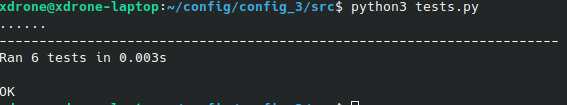

# Конвертер из json в учебный язык

Этот скрипт предназначен для обработки JSON-данных и их преобразования в пользовательский формат. Скрипт читает JSON-текст, извлекает константы и выражения, и преобразует их в специфический синтаксис, добавляя поддержку комментариев. Скрипт также обрабатывает вычисления и выводит результат в соответствии с заданными правилами.

## Описание работы

Скрипт выполняет несколько основных функций:

1. **Парсинг JSON-данных**: Извлекает данные из JSON-файла и проверяет их на ошибки синтаксиса.
2. **Преобразование в пользовательский синтаксис**: Конвертирует данные JSON в пользовательский формат с учетом констант и выражений.
3. **Обработка комментариев**: Преобразует комментарии в YAML в определенный формат.
4. **Обработка выражений**: Преобразует вычисления и выражения в результирующий текст.
   
### Основные этапы работы:

1. Чтение JSON-данных из стандартного ввода.
2. Преобразование данных в специфический формат.
3. Преобразование комментариев в определенный стиль (если длина комментария больше 50 символов, используется другой формат).
4. Вывод результата с комментариями и преобразованными данными.

## Установка и требования

Для работы скрипта требуется:

- Python 3.x
- Библиотека `json`

Чтобы установить зависимость, используйте pip:

```bash
pip install json
```

## Использование

1. Сохраните скрипт в файл, например `converter.py`.
2. Передайте JSON-текст через стандартный ввод или укажите путь к файлу, используя команду:

   ```bash
   python converter.py input.json output.conf
   ```

   Или для использования файла:

   ```bash
   cat input.json | python converter.py
   ```

3. Скрипт выведет результат в стандартный вывод, где будут отображены преобразованные данные и комментарии.

## Пример

**Входные данные (input.json):**

```yaml
{
  "server": {
    "host": "localhost",
    "port": 8080,
    "max_connections": 100,
    "paths": [
      "/home",
      "/user"
    ]
  },
  "database": {
    "host": "db.local",
    "port": 3306
  },
  "enabled": true,
  "timeout": 30,
  "threshold": 50,
  "config_name": "main_config",
  "paths": [
    "/api",
    "/docs"
  ],
  "max_connections": 200,
  "api_url": "$server_host$",
  "default_value": "$threshold$"
}
```

**Выходные данные:**

```plaintext
server is [
  host => localhost,
  port => 8080,
  max_connections => 100,
  paths => (/home, /user),
];
database is [
  host => db.local,
  port => 3306,
];
enabled is True;
timeout is 30;
threshold is 50;
config_name is main_config;
paths is (/api, /docs);
max_connections is 200;
api_url is $server_host$;
default_value is $threshold$;
```

**Результаты прогона тестов**

